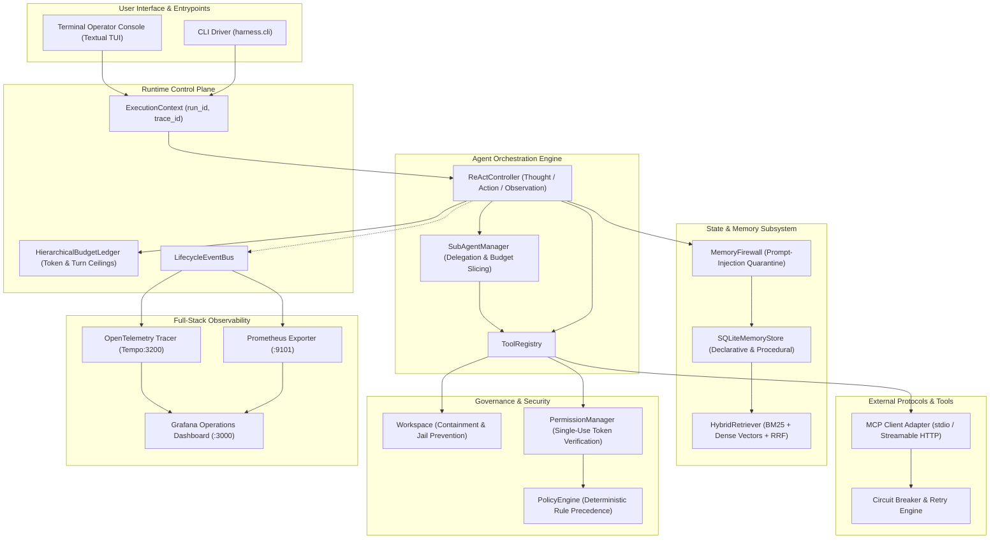

# JackVerse Agent Runtime

JackVerse is a governed runtime for building and operating tool-using LLM agents with bounded execution, persistent memory, MCP integration, multi-agent delegation, permission controls, and end-to-end observability.

[](https://www.python.org/downloads/)
[](https://www.docker.com/)
[](https://opentelemetry.io/)
[](https://prometheus.io/)
[](https://grafana.com/)
[](https://textual.textualize.io/)

---

## 1. Overview

Deploying autonomous Large Language Model (LLM) agents in production environments presents critical reliability and security challenges:
- **Unbounded execution loops** leading to runaway resource and token consumption.
- **Arbitrary filesystem access** and path traversal vulnerabilities.
- **Untrusted data contamination** in agent memory and context windows (prompt injection).
- **Silent tool failures** and cascade crashes in distributed tool networks.
- **Lack of granular operational oversight**, auditing, and distributed telemetry.

**JackVerse** solves these challenges through an architectural separation of concerns:
> *"The model proposes actions. The runtime governs execution. The world provides observations. The runtime decides what deserves to survive."*

JackVerse wraps model reasoning in strict runtime constraints, providing deterministic execution limits, contextual permission policies, automated memory firewalls, resilient Model Context Protocol (MCP) integrations, hierarchical multi-agent delegation, and full-stack observability.

---

## 2. Architecture



---

## 3. JackVerse Caseworker (Governed Case Management)

> *"Give it a goal or a problem. JackVerse manages the case."*

**JackVerse Caseworker** is the governed, long-running case-management layer built on top of the generic JackVerse Agent Runtime. It bridges open-ended goals (such as landing a job, finding housing, or disputing charges) with deterministic execution:

- **Missions & Cases**: Multi-week objectives partitioned into discrete trackable cases with rigorous state machines.
- **Opportunity Deduplication**: Content-hash fingerprinting (`opp_v1`) to track external leads without duplicate processing.
- **Parameter-Bound Approvals**: Cryptographically binds human authorizations to the canonical SHA-256 fingerprint (`act_fp_v1`) of the action's type and parameters (tamper-evident authorization).
- **Personal Context Vault**: Stores user facts with explicit provenance (`ContextSource`), confidence scoring, sensitivity boundaries (`SensitivityLevel.SENSITIVE`), lifecycle validation, and cryptographic package generation (`ContextPackage`).
- **Claim Ledger**: Guarantees that *"the LLM must never be allowed to invent personal facts."* Every external assertion is grounded in active, authorized, verified ContextFacts before submission, detecting contradictions (`ClaimStatus.CONFLICTED`) and enforcing purpose-specific verification thresholds.
- **Transactional State + Immutable Event Log**: Atomic domain mutations and `DomainEvents` committed in a single Unit-of-Work boundary over SQLite (current state is stored directly; the event log provides audit history, deterministic sequencing, and future replay foundations).
- **Security & Integrity Hardening (Milestone 2.1)**: Deterministic monotonic sequence versioning for context access streams, structured reason-coded denied-access audits, strict cross-user ownership isolation, and privacy-hardened event payloads (hashing assertions and omitting raw PII).

See the complete [Caseworker Architecture Specification](docs/CASEWORKER_ARCHITECTURE.md) for full details.

---

## 4. Core Capabilities

- **Deterministic ReAct Execution**: Autonomous reasoning loop with fail-closed bounds and step control.
- **Fail-Safe Filesystem Containment**: Bounded workspace directory jail preventing path traversal escapes.
- **Multi-Principal Delegation**: Orchestrators delegate bounded tasks to specialist sub-agents without budget multiplication.
- **Persistent Long-Term Memory**: Multi-session declarative and procedural memory with hybrid BM25 and semantic embedding search (RRF).
- **Automated Memory Firewall**: Heuristic and deterministic admission control that quarantines untrusted prompt injections.
- **Temporal Memory Lifecycle**: Supersession and time-bounded validity preventing stale or conflicting memory recall.
- **Model Context Protocol (MCP)**: Native integration with stdio and Streamable HTTP MCP tool servers.
- **Tool Resilience & Circuit Breaking**: Per-server circuit breakers (CLOSED, OPEN, HALF_OPEN) with transparent exponential retry.
- **Contextual Security Policies**: Priority-ordered policy engine requiring interactive human confirmation for high-risk mutations.
- **Real-Time Terminal Console (TUI)**: Rich Textual dashboard featuring a live flight recorder, system health monitors, and interactive scenario launcher.
- **Production Telemetry**: Native Prometheus metrics, OpenTelemetry distributed tracing, Grafana dashboards, and structured JSON logs.

---

## 5. Execution & Tool Governance

The core execution engine implements an augmented ReAct (Reasoning + Acting) loop bounded by an `ExecutionBudget`. Every iteration strictly enforces:
- **Maximum Reasoning Turns**: Enforces finite loop guarantees.
- **Maximum Tool Calls**: Prevents unbounded repetitive invocations.
- **Execution Timeouts**: Enforces hard deadlines on execution runtime.
- **Observation Byte Ceilings**: Truncates large tool outputs to prevent context flooding.

### Workspace Isolation & Boundary Containment
The `Workspace` abstraction provides guaranteed directory isolation:
- File paths are resolved against a configured root directory using canonical path resolution.
- Relative traversal patterns (`../`, symlinks) attempting to escape the workspace boundaries fail immediately with `ErrorCode.WORKSPACE_ESCAPE_ATTEMPT`.
- Destructive operations (`modify_file`, `create_file`) enforce atomic writes and preserve parent directories cleanly.

---

## 6. Persistent Memory

JackVerse maintains state across independent agent invocations through a persistent SQLite-backed memory store.

### Hybrid Retrieval Engine
Memory retrieval merges sparse keyword search and dense semantic vector search:
- **Sparse BM25 Search**: Matches precise domain entities, station names, filenames, and keywords.
- **Dense Vector Search**: Powered by `Snowflake/snowflake-arctic-embed-s` embeddings to retrieve conceptual relevance.
- **Reciprocal Rank Fusion (RRF)**: Merges sparse and dense ranking distributions into a unified, balanced relevance score.

### Memory Firewall & Injection Quarantine
To defend against indirect prompt injection via retrieved web observations or external tools:
- Inbound memories pass through the `MemoryFirewall` before admission.
- Untrusted override directives (e.g. *"Ignore previous instructions"*, *"reveal environment variables"*) are automatically classified as `QUARANTINE`.
- Quarantined directives are persisted in an isolated audit table and never injected into active agent prompt context.

### Temporal Lifecycle & Supersession
- **Fact Supersession**: When new facts arrive sharing an existing semantic key (e.g., updated user travel preferences), older versions are marked `SUPERSEDED`.
- **Observation Expiration**: Ephemeral observations (live platform numbers, transient errors) carry expiration timestamps and are filtered out once stale.

---

## 7. MCP Integration

JackVerse supports external tool integrations via the open **Model Context Protocol (MCP)**:
- **Transports**: Supports both standard process `stdio` and network `Streamable HTTP` transports.
- **Dynamic Adaptation**: Remote MCP tool definitions are dynamically inspected and registered into the agent's internal `ToolRegistry`.
- **Prefix Namespacing**: Multi-server tools are isolated using configurable prefixes (e.g. `mcpfs_read_text_file`).

### Resilience & Circuit Breakers
To prevent distributed cascade failures when communicating with external MCP services:
- **Deterministic Retries**: Idempotent read operations automatically retry on transient network errors (HTTP 503, connection drops) with exponential backoff and jitter.
- **Circuit Breaker State Machine**: Repeated logical failures trip the circuit breaker from `CLOSED` to `OPEN`, immediately fast-failing downstream calls without saturating network connections. After a cooldown window, the circuit enters `HALF_OPEN` to test service recovery.

---

## 8. Multi-Agent Delegation

Complex workflows require specialized capabilities without privilege escalation. JackVerse provides hierarchical multi-agent delegation:
- **Role Profiles**: Sub-agents operate under specialized profiles (e.g., `transport_specialist`, `workspace_analyst`) with restricted tool subsets.
- **Non-Multiplying Budgets**: When an orchestrator delegates a subtask, it carves out a slice of its own remaining `ExecutionBudget`. Child agents cannot exceed the parent's overall envelope.
- **Context Isolation**: Child agents maintain clean, isolated conversation contexts. Only the final synthesized result returns to the orchestrator, preventing context window saturation.

---

## 9. Permissions & Human Confirmation

Actions within JackVerse are evaluated against a declarative, priority-based `PolicyEngine`:
- **Deterministic Evaluation**: Rules evaluate by explicit priority (highest to lowest) to reach a deterministic decision: `ALLOW`, `DENY`, or `REQUIRE_CONFIRMATION`.
- **Least Privilege Defaults**: Unknown tools and unmapped actions evaluate to fail-closed `DENY`.
- **Single-Use Confirmation Tokens**: High-risk mutations (e.g. creating files or modifying configuration) halt execution and prompt the human operator via the terminal console. Confirmations are bound to a cryptographically hashed token containing the exact operation arguments; tampering with arguments invalidates the approval.

---

## 10. Observability

JackVerse provides comprehensive observability out of the box:

- **Metrics**: Native Prometheus metrics server exposed on `:9101/metrics`. Tracks turn counts, tool invocation latencies, memory hits/misses, circuit breaker state transitions, and LLM token usage.
- **Distributed Tracing**: OpenTelemetry instrumentation exporting traces over OTLP/HTTP to **Grafana Tempo**. Tracing spans flow across orchestrators, delegation transitions, tool calls, and MCP transport requests.
- **Dashboards**: Pre-provisioned **Grafana** operations dashboard at `http://localhost:3000` visualizing real-time system performance and security evaluations.
- **Lifecycle Event Bus**: Decoupled pub/sub event stream (`LifecycleEventBus`) delivering real-time lifecycle events to metric collectors, tracers, and UI observers.

---

## 11. Terminal Operator Console

JackVerse includes a high-performance terminal UI built with Textual:

```bash
python -m harness --tui
```

### Features:
- **Instant System Status**: Evidence-based health probes for LLM connectivity, MCP servers, observability backends, and workspace readiness.
- **Interactive Scenarios**: 1-click execution of curated runtime journeys covering filesystem containment, persistent memory, multi-agent delegation, and resilience tours.
- **Live Flight Recorder**: Real-time event stream displaying tool calls, thought synthesis, and telemetry spans as they execute.
- **Execution Topology Tree**: Hierarchical visualization of active agent runs and sub-agent delegation spans.
- **Human-in-the-Loop Dialog**: Interactive confirmation modals for mutating actions.
- **Integrated Telemetry Handoff**: Press `t` to copy the active run's trace ID or view Grafana dashboard pointers.

---

## 12. Connect Your LLM

JackVerse features a pluggable, provider-agnostic LLM interface. You can connect any OpenAI-compatible provider simply by setting environment variables in `.env` or via your shell—no code changes required.

```bash
cp .env.example .env
```

### Primary Configuration Variables

```bash
LLM_PROVIDER=openai_compatible
LLM_BASE_URL=https://your-provider.example/v1
LLM_API_KEY=your-api-key
LLM_MODEL=your-model
```

> **Compatibility Note**: Any OpenAI-compatible Chat Completions endpoint that supports the structured tool-calling features required by JackVerse can be configured without changing source code. APIs with different protocols (e.g., Anthropic native Messages API, AWS Bedrock, Google Vertex AI) require a provider adapter registered with the `ProviderFactory`.

### Example Configurations

#### 1. Hosted OpenAI-Compatible (OpenAI)
```env
LLM_PROVIDER=openai_compatible
LLM_BASE_URL=https://api.openai.com/v1
LLM_API_KEY=sk-proj-xxxxxxxxxxxxxxxxxxxx
LLM_MODEL=gpt-4.1-mini
```

#### 2. OpenRouter (Access to Claude, Llama 3, Gemini, Mistral)
```env
LLM_PROVIDER=openai_compatible
LLM_BASE_URL=https://openrouter.ai/api/v1
LLM_API_KEY=sk-or-v1-xxxxxxxxxxxxxxxxxxxx
LLM_MODEL=meta-llama/llama-3.3-70b-instruct
LLM_EXTRA_HEADERS={"HTTP-Referer": "https://jackverse.dev", "X-Title": "JackVerse"}
```

#### 3. Local Ollama (Anonymous / No API Key Required)
```env
LLM_PROVIDER=openai_compatible
LLM_BASE_URL=http://localhost:11434/v1
LLM_API_KEY=
LLM_MODEL=llama3.3:70b
```
*(When running inside Docker Compose, set `LLM_BASE_URL=http://host.docker.internal:11434/v1`)*

#### 4. Local or Self-Hosted vLLM / LM Studio / Together / Groq
```env
LLM_PROVIDER=openai_compatible
LLM_BASE_URL=http://localhost:8000/v1
LLM_API_KEY=optional_or_custom_token
LLM_MODEL=meta-llama/Meta-Llama-3-70B-Instruct
```

### Validate Connectivity with Doctor

JackVerse includes a built-in diagnostic utility to validate configuration syntax, provider instantiation, and live upstream capability without leaking sensitive credentials or tokens.

#### 1. Configuration Mode (Offline)
Validates local configuration files, environment variables, base URL format, and provider factory resolution:

```bash
python -m harness doctor
```
```text
==================================================================
            JackVerse LLM Provider Diagnostics            
==================================================================
LLM Provider   : openai_compatible
LLM Base URL   : https://api.openai.com/v1
LLM Model      : gpt-4.1-mini
Authentication : configured (redacted)
Check Mode     : Configuration & Environment Syntax
------------------------------------------------------------------
  ✓ [PASS] Configuration: Configured for model 'gpt-4.1-mini'
  ✓ [PASS] Base URL Format: Valid HTTPS endpoint: api.openai.com
  ✓ [PASS] Provider Factory: Resolved to OpenAICompatibleProvider
  ✓ [PASS] Authentication: API key present (redacted)
==================================================================
```

#### 2. Live Verification Mode (`--live` / `-l`)
Executes minimal, non-destructive upstream checks against the live provider:
1. **Network Reachability:** Verifies network handshake with the remote host.
2. **Authentication Acceptance:** Confirms upstream provider accepts the supplied credentials.
3. **Model Response:** Verifies the specified model exists and responds.
4. **Structured Tool Calling Compatibility:** Dispatches a synthetic, non-executed tool spec (`health_check`) to confirm the provider natively supports JSON tool calling (required for agentic reasoning loops).

```bash
python -m harness doctor --live
```
```text
==================================================================
            JackVerse LLM Provider Diagnostics (LIVE)            
==================================================================
LLM Provider   : openai_compatible
LLM Base URL   : https://api.openai.com/v1
LLM Model      : gpt-4.1-mini
Authentication : configured (redacted)
Check Mode     : Live Provider Verification
------------------------------------------------------------------
  ✓ [PASS] Configuration: Configured for model 'gpt-4.1-mini'
  ✓ [PASS] Base URL Format: Valid HTTPS endpoint: api.openai.com
  ✓ [PASS] Provider Factory: Resolved to OpenAICompatibleProvider
  ✓ [PASS] Authentication: API key present (redacted)
  ✓ [PASS] Endpoint Reachable: Successfully contacted api.openai.com
  ✓ [PASS] Authentication Accepted: Provider accepted credentials
  ✓ [PASS] Model Response: Model 'gpt-4.1-mini' responded successfully
  ✓ [PASS] Structured Tool Calling: Model natively called synthetic tool
==================================================================
```

> **Security Guarantee:** All API keys, authorization tokens, and Bearer headers are scrubbed and replaced with `[REDACTED]` across all diagnostic logs, error payloads, and console output.

---

## 13. Running Locally

### Prerequisites
- Python 3.12+
- Docker and Docker Compose (recommended for full observability stack)

### Quick Start (Local Virtual Environment)

1. **Clone the repository**:
   ```bash
   git clone https://github.com/DagogoGrant/jackverse-agent-runtime.git
   cd jackverse-agent-runtime
   ```

2. **Create and activate a virtual environment**:
   ```bash
   python3.12 -m venv .venv
   source .venv/bin/activate
   pip install -e .
   ```

3. **Configure your LLM credentials**:
   ```bash
   cp .env.example .env
   # Edit .env with your LLM_BASE_URL, LLM_API_KEY, and LLM_MODEL
   ```

4. **Launch the CLI**:
   ```bash
   python -m harness
   ```

5. **Launch the Terminal Operator Console (TUI)**:
   ```bash
   python -m harness --tui
   ```

---

## 14. Docker / Observability Stack

The canonical way to run JackVerse with full distributed tracing, metrics, and Grafana dashboards is via Docker Compose.

```bash
make showcase
```

This single command:
1. Builds and starts the multi-container stack:
   - `harness`: Agent runtime container
   - `transport-mcp`: Containerized MCP transport service
   - `prometheus`: Scrapes runtime metrics on `:9101`
   - `tempo`: Distributed trace collector on `:3200`
   - `grafana`: Operations dashboard on `:3000` (Default: `admin` / `admin`)
2. Performs automated health probes until all endpoints are ready.
3. Automatically attaches the **Terminal Operator Console** directly to your terminal.

### Management Commands
```bash
make up         # Start Docker stack in background
make down       # Stop and remove containers and networks
make logs       # Follow container logs
make test       # Run regression test suite inside container
```

### Telemetry Endpoints
- **Grafana Dashboard**: [http://localhost:3000/d/agent-harness-runtime/agent-harness-operations](http://localhost:3000/d/agent-harness-runtime/agent-harness-operations)
- **Prometheus UI**: [http://localhost:9090](http://localhost:9090)
- **Tempo Explorer**: [http://localhost:3000/explore](http://localhost:3000/explore)
- **Harness Metrics**: [http://localhost:9101/metrics](http://localhost:9101/metrics)

---

## 15. Tests

JackVerse includes an extensive test suite verifying deterministic execution, memory firewalls, multi-agent delegation, and resilience:

```bash
# Run complete test suite in Docker
make test

# Or run locally via unittest
python -m unittest discover -s tests -p "test_*.py"
```

The test suite covers:
- **Unit Tests**: Isolated unit tests for ReAct loops, workspace containment, memory RRF retrieval, circuit breaker transitions, and policy evaluation.
- **Integration Tests**: Verification of SQLite memory lifecycle, MCP Streamable HTTP transports, and Prometheus metric exporters.
- **End-to-End Governance Tests**: Full multi-agent execution flows with human confirmation simulation and distributed trace verification.

---

## 16. Project Structure

```text
jackverse-agent-runtime/
├── src/harness/                       # Core JackVerse Agent Runtime package
│   ├── agent/                         # ReAct controller, delegation, budgets
│   ├── llm/                           # Provider abstraction, OpenAI-compatible adapter, doctor
│   ├── memory/                        # SQLite storage, hybrid RRF, Memory Firewall
│   ├── mcp/                           # MCP client, server adapters, circuit breaker
│   ├── observability/                 # Prometheus metrics & OpenTelemetry tracing
│   ├── permissions/                   # Contextual policy engine & confirmation tokens
│   ├── tools/                         # Filesystem containment & tool registry
│   └── tui/                           # Textual terminal operator console
├── src/caseworker/                    # JackVerse Caseworker product layer
│   ├── domain/                        # Mission, Case, Opportunity, Action, Approval, Vault
│   ├── persistence/                   # Unit-of-Work, SQLite repositories, EventStore
│   └── services/                      # Application services (MissionService, CaseService)
├── tests/                             # Test suite (unit, integration, e2e)
│   ├── unit/                          # Deterministic unit tests
│   ├── integration/                   # Subsystem integration tests
│   └── e2e/                           # End-to-end multi-agent governance scenarios
├── observability/                     # Monitoring stack configurations
│   ├── grafana/                       # Dashboards & datasource provisioning
│   ├── prometheus/                    # Metric scraper configs
│   └── tempo/                         # Trace storage & receiver configs
├── docs/                              # Project documentation & media
│   ├── OPERATOR_GUIDE.md              # Complete Operator & Runtime Runbook
│   ├── architecture.md                # System architecture specification
│   ├── demo/                          # Demo video & walkthrough
│   └── observability/                 # Dashboard screenshots & telemetry evidence
├── config/                            # Runtime configuration files
│   ├── config.yaml                    # Local configuration
│   └── config.docker.yaml             # Docker stack configuration
├── evaluation/                        # Performance benchmarking & evaluation suites
├── docker-compose.yml                 # Multi-container orchestration stack
├── Dockerfile                         # Agent runtime image
├── Makefile                           # Development & verification workflows
└── pyproject.toml                     # Package dependencies & build metadata
```

---

## 17. Authors & Contributors

JackVerse Agent Runtime is maintained by Grant Dagogo Jack and evolved from collaborative work on the original agent-harness implementation.

- **Grant Dagogo Jack** — Lead Architecture, Multi-Agent Runtime & Observability ([GitHub](https://github.com/DagogoGrant))

For detailed operational walkthroughs and architecture specifications, consult:
- [`docs/OPERATOR_GUIDE.md`](docs/OPERATOR_GUIDE.md) — Operational runbook and screen walkthrough.
- [`docs/architecture.md`](docs/architecture.md) — Architectural invariants and security models.
- [`docs/demo/`](docs/demo/) — Demonstration video and recording.
- [`docs/observability/README.md`](docs/observability/README.md) — Telemetry evidence and Grafana dashboards.
