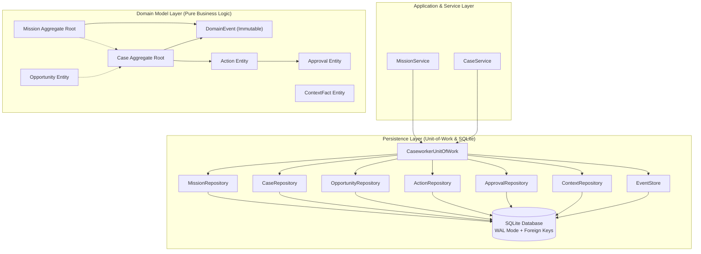
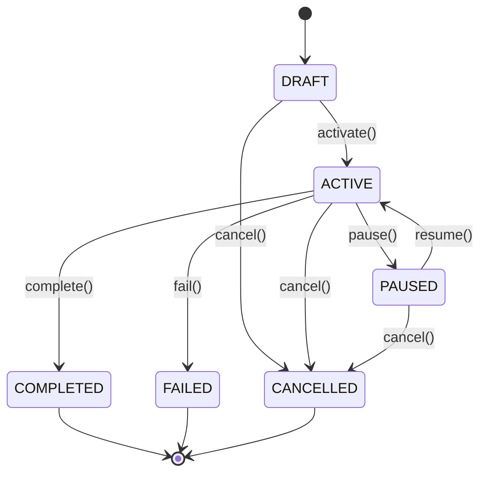
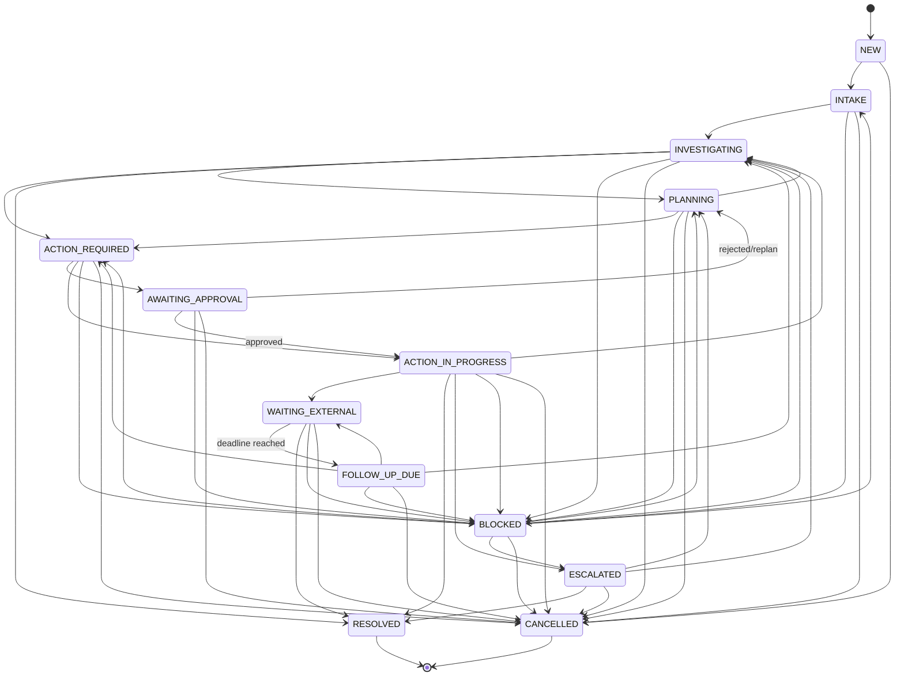
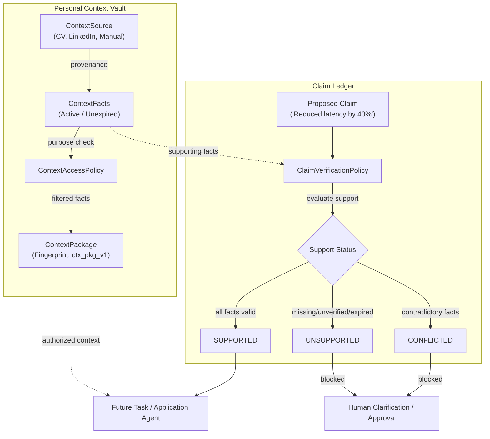
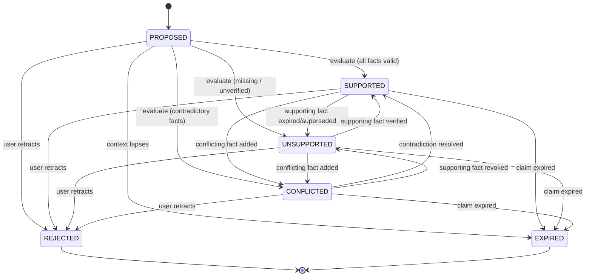

# JackVerse Caseworker: Architecture & Domain Foundation

> *"Give it a goal or a problem. JackVerse manages the case."*

---

## 1. Vision & Executive Summary

Modern AI agents often operate as ephemeral chat sessions or ungrounded script runners. When faced with complex, long-running personal or professional objectives—such as landing a new job, relocating to a new country, securing a research grant, or disputing an unfair charge—users are forced to micromanage every intermediate prompt, track spreadsheets manually, and worry whether the agent will execute consequential real-world actions without oversight.

**JackVerse Caseworker** is a governed, long-running case management system built on top of the **JackVerse Agent Runtime**. It transforms open-ended user goals into structured, durable cases with explicit lifecycles, tamper-evident human approvals, deduplicated opportunity tracking, and verifiable personal context.

```text
┌──────────────────────────────────────────────────────────┐
│                   JackVerse Caseworker                   │
│   (Missions, Cases, Opportunities, Approvals, Vault)     │
└────────────────────────────┬─────────────────────────────┘
                             │
                             ▼
┌──────────────────────────────────────────────────────────┐
│                 JackVerse Agent Runtime                  │
│  (Bounded ReAct, ToolRegistry, Memory Firewall, MCP,     │
│   Execution Budgets, LLM Provider Layer, Observability)  │
└──────────────────────────────────────────────────────────┘
```

---

## 2. Core Domain Distinctions

To prevent conceptual blur, JackVerse Caseworker enforces strict boundaries between its primary entities:

| Domain Entity | Scope & Purpose | Example |
| :--- | :--- | :--- |
| **Mission** | High-level, long-running user objective that can span multiple Cases over weeks or months. | *"Secure a Senior AI Engineer position in Germany by Q3."* |
| **Case** | One concrete, trackable unit of work with a dedicated goal, status machine, and verifiable outcome. | *"Apply to Anthropic Research Engineer (Req #4021)."* |
| **Opportunity** | An external lead or prospect discovered for the user, deduplicated by content fingerprint. | *Job posting, grant announcement, or apartment listing.* |
| **Action** | A single real-world operational step proposed or taken in service of a Case, evaluated for risk. | *Draft cover letter, send inquiry email, or submit application form.* |
| **Approval** | Durable, parameter-bound user authorization bound cryptographically to an Action's exact parameters. | *Explicit human sign-off required prior to submitting official application.* |
| **ContextFact** | Persistent, provenance-tracked personal memory (education, preferences, constraints) with purpose gating. | *Passport country, target salary range, or visa sponsorship need.* |
| **DomainEvent** | Immutable, sequentially ordered record of aggregate state transitions. | *`mission.created`, `case.status_changed`, `action.proposed`.* |

---

## 3. System Architecture & Boundaries



### Architectural Principles

1. **Zero Runtime Contamination**: All Caseworker domain code lives in `src/caseworker/`. Generic harness runtime primitives (`src/harness/`) remain 100% agnostic to Caseworker concepts.
2. **Atomic Domain State + Event Persistence**: Domain entity mutations and corresponding `DomainEvents` commit within the same SQLite transaction via `CaseworkerUnitOfWork`. Rollback on any failure guarantees zero state/event drift.
3. **Optimistic Concurrency**: Every aggregate root and entity tracks a monotonic `version` counter. Concurrent updates that conflict with the expected version fail fast with `OptimisticLockError`.
4. **Deterministic Deduplication**: External opportunities are fingerprinted via `opp_v1` using normalized organization, title, type, and source URL, intentionally excluding volatile timestamps and mission IDs.

---

## 4. State Machines & Invariants

### 4.1 Mission Lifecycle



- **Invariants**: Terminal states (`COMPLETED`, `CANCELLED`, `FAILED`) are immutable. Once reached, transitions to any other state are strictly prohibited.

### 4.2 Case Lifecycle



---

## 5. Approval & Action Safety Model

Consequential actions (such as submitting official applications, committing funds, sending signed communications, or requesting refunds) pose real-world risk. JackVerse Caseworker introduces a **cryptographic parameter-bound approval model**:

1. **Risk Classification**: Actions are assigned a `RiskLevel`:
   - `LOW`: Read-only queries, research drafting (does not require approval by default).
   - `MEDIUM`: Internal state transitions, preparations.
   - `HIGH`: Submitting applications, issuing external inquiries (requires approval).
   - `CRITICAL`: Financial transactions, legal disclosures, binding contracts (requires approval).
2. **Canonical Fingerprint Calculation**:
   ```python
   canonical = canonical_json_dumps([
       "act_fp_v1",
       action.action_id,
       action.case_id,
       action.action_type,
       action.description.strip(),
       action.parameters,  # Deterministically key-sorted
   ])
   fingerprint = compute_sha256(canonical)
   ```
3. **Idempotency & Execution Safety**:
   Action `idempotency_key` provides an idempotency foundation for retry-safe execution within the database boundary. True external exactly-once or at-most-once behavior will depend on the eventual execution adapter and external provider capabilities.

4. **Tamper Detection & Invalidation**: The `Approval` record binds to this exact fingerprint. If an agent or attacker alters `action.parameters` or `action.description` after approval is requested, `approval.is_valid_for(action)` immediately evaluates to `False`, and `approval.approve(action)` raises `ApprovalValidationError`.

---

## 6. Personal Context Vault & Access Policy

The Personal Context Vault provides governed, verifiable storage for user identity, credentials, career history, preferences, and constraints.

> **Foundational Principle:**
> *"The LLM must never be allowed to invent personal facts."*
> Every external factual assertion must be grounded in explicit, active, verified ContextFacts in the user's vault.

### 6.1 Vault Domain Model

1. **ContextSource**: Distinct entity tracking provenance origin (e.g., CV upload, profile import, third-party verifier, user input).
   - Agent inferences (`SourceType.AGENT_INFERENCE`) represent provenance, **not verification**, and remain strictly `UNVERIFIED` until confirmed.
   - Tracks optimistic concurrency `version` and redacts sensitive references in `to_safe_dict()` and `__repr__`.
2. **ContextFact**: Verifiable factual assertion (e.g., degree, skill, email, salary constraint).
   - **Lifecycle States**: Computed properties ensure facts are only considered active when not superseded, not rejected, and not expired:
     - `is_active`: `not is_superseded and not is_rejected and not is_expired`
     - `is_expired`: `expires_at is not None and now_utc() > expires_at`
     - `is_superseded`: `superseded_by_fact_id is not None`
     - `is_rejected`: `verification_status == VerificationStatus.REJECTED`
   - **Historical Lineage**: When facts are superseded, prior records are preserved with `superseded_by_fact_id` and `superseded_at`.
   - **Safe Redaction**: Facts with `sensitivity == SensitivityLevel.SENSITIVE` redact raw values to `"[REDACTED]"` in safe display representations and domain event payloads.
3. **ContextAccessPolicy**: Purpose-aware access evaluator.
   - **Conservative Default**: SENSITIVE facts are inaccessible unless explicitly authorized for the requested purpose in `allowed_purposes`.
   - **Lifecycle Guard**: Expired, superseded, or rejected facts are never granted access.
   - **Confidence Gating**: Evaluates whether fact confidence satisfies required thresholds.
4. **ContextPackage & Builder**:
   - Compiles authorized, purpose-scoped bundles of active facts for consumption by tasks or downstream agents.
   - Computes a deterministic SHA-256 fingerprint (`ctx_pkg_v1`) over canonically sorted fact IDs and attributes to detect tampering.
5. **Profile Completeness**:
   - `ProfileCompletenessEvaluator` audits active facts against `RequirementSet` specifications (e.g. `standard_job_application_requirements`, `standard_housing_application_requirements`).
   - Classifies requirements into `satisfied`, `missing`, `unverifiable`, and `expired` with a quantitative completeness ratio.

---

## 7. Claim Ledger & Support Policy

The Claim Ledger sits between the user's Personal Context Vault and external applications, ensuring that any statement made on the user's behalf is verifiable and grounded.



### 7.1 Claim Aggregate Root & Lifecycle



### 7.2 Claim Verification Policy & Contradiction Detection

1. **Ownership Invariant**: All supporting facts must belong to the claim's owner.
2. **Lifecycle Invariant**: Supporting facts must be active (unexpired, unsuperseded, unrejected).
3. **Purpose Gating**: Supporting facts must be authorized for the claim's intended purpose.
4. **Verification Threshold**: Facts must meet the minimum verification rank required by the purpose (e.g. `USER_VERIFIED` for job/housing applications).
5. **Contradiction Detection**: If two or more active supporting facts declare conflicting values for the same normalized `(namespace, key)`, the policy evaluates the claim to `ClaimStatus.CONFLICTED`.

---

## 8. 14-Phase Implementation Roadmap

The Caseworker vision unfolds across 14 systematic phases:

```text
Phase 1:  Domain Foundation                     (COMPLETE)
Phase 2:  Personal Context Vault + Claim Ledger  (COMPLETE)
Phase 3:  API Service Layer
Phase 4:  Consumer Web UI
Phase 5:  Opportunity Discovery Engine
Phase 6:  Governed Async Subagents
Phase 7:  Planning / Dependency DAG
Phase 8:  Durable Workflows + HITL
Phase 9:  Browser / Connector Action Layer
Phase 10: Application & Document Engine
Phase 11: Communication / Tracking
Phase 12: Evals + Replay
Phase 13: Security Hardening
Phase 14: Multi-user Production Hardening
```

