# JackVerse Agent Runtime Architecture

## 1. Architectural Goal

The agent runtime is structured around three foundational operational challenges:

- **Execution & Containment Foundation**: *How do we safely let a Large Language Model (LLM) act?*
- **Persistent State & External Tool Integration**: *How do we safely connect the runtime to external capabilities and persistent state without degrading safety, determinism, or operational competence?*
- **Governance & Multi-Agent Delegation**: *How do we govern multi-agent task delegation and tool mutations under strict policy controls and observability?*

This architecture is governed by core operational principles:

> **"The model proposes actions. The runtime governs execution."**
> *(Execution & Containment Principle)*

> **"The world provides evidence. The runtime decides what deserves to survive."**
> *(State Governance Principle)*

The runtime does not treat the LLM as an autonomous agent with unrestricted environment access. Instead, the model is a bounded reasoning engine operating within strict structural boundaries: every tool invocation is validated, every external observation is constrained, and all state transitions (admission, supersession, expiration, and procedural lesson extraction) are governed deterministically by the runtime.

---

## 2. System Architecture

The following diagram reflects the component hierarchy, governance boundaries, multi-principal delegation, and cross-cutting observability across the JackVerse system:

```mermaid
flowchart TD
    subgraph UserInterface["User & Orchestration Layer"]
        User["User"]
        CLI["CLI Driver (harness.cli)"]
        RootCtx["Root ExecutionContext (root_run_id, trace_id, agent_role='orchestrator')"]
        RootBudget["HierarchicalBudgetLedger (Root Capacity & Anti-Multiplication)"]
    end

    subgraph OrchestratorCore["Orchestrator Agent (harness.agent)"]
        OrchReAct["Orchestrator ReActController"]
        OrchContext["Isolated Short-Term Context (self.context)"]
        OrchRegistry["Orchestrator ToolRegistry (delegate_task, create_file)"]
    end

    subgraph GovernanceLayer["Common Security & Enforcement Layer (harness.permissions)"]
        Executor["Per-Agent ToolExecutor Instances<br/>(Common Enforcement Architecture)"]
        PermMgr["PermissionManager"]
        Policy["PolicyEngine (Deterministic Precedence)"]
        ConfirmHandler["ConfirmationHandler (Single-Use, Bound Token)"]
    end

    subgraph DelegationSubsystem["Multi-Principal Sub-Agent System (harness.agent.delegation)"]
        DelegateTool["DelegateTaskTool"]
        SubMgr["SubAgentManager (Budget Slicing & ContextVar Scoping)"]
        AgentFact["AgentFactory"]

        subgraph SpecialistTransport["Specialist: transport_specialist"]
            TransCtrl["transport_specialist Controller"]
            TransCtx["Child ExecutionContext (delegation_depth=1, parent_run_id)"]
            TransReg["Transport ToolRegistry (find_connection)"]
        end

        subgraph SpecialistWorkspace["Specialist: workspace_analyst"]
            WorkCtrl["workspace_analyst Controller"]
            WorkCtx["Child ExecutionContext (delegation_depth=1, parent_run_id)"]
            WorkReg["Workspace ToolRegistry (read_file, list_dir, search)"]
        end
    end

    subgraph ToolProviders["Tool Execution Providers"]
        FSTools["Built-in Filesystem Tools (harness.tools.filesystem)"]
        MCPAdapter["MCPToolAdapter (harness.mcp.adapter)"]
        MCPClient["MCPClient (harness.mcp.client)"]
        MCPServer["External MCP Server (transport_service)"]
    end

    subgraph CrossCuttingObservability["Cross-Cutting Observability Subsystem (harness.observability)"]
        EventBus["LifecycleEventBus (Event Dispatcher)"]
        PromObs["PrometheusObserver"]
        OTelObs["OpenTelemetryObserver"]
        LogObs["StructuredLogObserver"]

        PromServer["Prometheus Server (:9090)"]
        TempoServer["Tempo Distributed Tracing (:3200)"]
        GrafanaUI["Grafana Dashboard (:3000)"]
    end

    subgraph MemoryLayer["Persistent Memory Subsystem (harness.memory)"]
        MemMgr["MemoryManager"]
        Firewall["MemoryFirewall (Quarantine & Normalization)"]
        SQLite["SQLite Relational Storage (.agent_memory/memory.db)"]
    end

    %% Wiring & Control Flow
    User -->|Prompt| CLI
    CLI --> RootCtx
    CLI --> RootBudget
    CLI --> OrchReAct
    OrchReAct <--> OrchContext
    OrchReAct --> OrchRegistry

    %% Common Enforcement
    OrchReAct -->|Dispatch Tool| Executor
    Executor --> PermMgr
    PermMgr --> Policy
    Policy -->|ALLOW| Executor
    Policy -->|DENY| Executor
    Policy -->|REQUIRE_CONFIRMATION| ConfirmHandler
    ConfirmHandler -->|Approved Token| Executor

    %% Dispatch from Executor to targets
    Executor -->|Execute Tool| FSTools
    Executor -->|Execute MCP Tool| MCPAdapter
    MCPAdapter --> MCPClient --> MCPServer
    Executor -->|Execute Delegation| DelegateTool

    %% Sub-agent Delegation Flow
    DelegateTool --> SubMgr
    SubMgr -->|Slice Budget| RootBudget
    SubMgr -->|Fork Context| AgentFact
    AgentFact --> TransCtrl
    AgentFact --> WorkCtrl

    TransCtrl --> TransCtx
    TransCtrl --> TransReg
    TransCtrl -->|Enforce via Common Path| Executor

    WorkCtrl --> WorkCtx
    WorkCtrl --> WorkReg
    WorkCtrl -->|Enforce via Common Path| Executor

    TransCtrl -.->|Return Output Only| SubMgr
    WorkCtrl -.->|Return Output Only| SubMgr
    SubMgr -.->|ToolResult| DelegateTool

    %% Observability Event Flow
    OrchReAct -.->|Events| EventBus
    Executor -.->|Events| EventBus
    PermMgr -.->|Events| EventBus
    SubMgr -.->|Events| EventBus

    EventBus --> PromObs
    EventBus --> OTelObs
    EventBus --> LogObs

    PromObs -->|/metrics :9101| PromServer --> GrafanaUI
    OTelObs -->|OTLP Traces| TempoServer --> GrafanaUI

    %% Memory Flow
    OrchReAct --> MemMgr
    MemMgr --> Firewall --> SQLite
```



### Component Responsibilities & Ownership
1. **`ReActController`** (`src/harness/agent/react.py`):
   - Orchestrates the synchronous `run_turn` Reason-Act-Observe loop.
   - Maintains in-memory short-term context (`self.context`).
   - Evaluates resource limits via cooperative checks against `ExecutionBudget` and `HierarchicalBudgetLedger`.
   - Directly dispatches tool requests exclusively through `ToolExecutor`.
2. **`ToolExecutor`** (`src/harness/tools/executor.py`):
   - **Authoritative, common enforcement boundary** for all tool calls across all principals (built-in filesystem tools, external MCP tools, and `DelegateTaskTool`).
   - **Per-Agent Instances with Shared Enforcement**: Every agent controller (the root orchestrator and each dynamically instantiated child specialist via `AgentFactory.create_agent()`) receives its own dedicated `ToolExecutor` object instance. Each instance maintains its own observation ceiling and execution state while delegating authorization checks to the shared `PermissionManager` and `PolicyEngine`.
   - Evaluates action authorizations through `PermissionManager` before dispatch.
   - Enforces schema validation against `ToolSpec` definitions.
   - Contains unhandled exceptions into structured `ToolResult(is_error=True)` representations.
   - Enforces the authoritative observation ceiling (`max_observation_chars`).
3. **`PermissionManager` & `PolicyEngine`** (`src/harness/permissions/`):
   - Evaluates permission requests under a **closed-default stance** (`ALLOW`, `DENY`, `REQUIRE_CONFIRMATION`).
   - Enforces deterministic rule precedence (priority descending, stance tie-break, declaration order).
   - Issues and validates single-use, 6-tuple digest-bound confirmation tokens (`run_id`, `call_id`, `agent_role`, `canonical_tool_identity`, `arguments_fingerprint`, `created_at`).
4. **`SubAgentManager` & `AgentFactory`** (`src/harness/agent/delegation.py`):
   - Manages the lifecycle, budget allocation, and context isolation for specialized sub-agents.
   - Constructs fresh, isolated `ReActController` instances with role-specific `ToolRegistry` subsets.
   - Enforces complete conversational context isolation: children receive only their system prompt and delegated task; zero parent turns or observations leak.
   - Intercepts child completion and packages only terminal text into a `ToolResult` for the parent.
5. **`HierarchicalBudgetLedger`** (`src/harness/agent/ledger.py`):
   - Enforces strict capacity conservation and anti-multiplication guarantees.
   - Pre-allocates clamped budget slices to children and atomically reconciles actual consumption upon return.
6. **Cross-Cutting Observability** (`src/harness/observability/`):
   - Subscribes `PrometheusObserver`, `OpenTelemetryObserver`, and `StructuredLogObserver` to `LifecycleEventBus`.
   - Exposes Prometheus metrics via `/metrics` on port `9101` for scraping by Prometheus and visualization in Grafana.
   - Exports distributed traces with exact parent-child span hierarchy to Grafana Tempo on port `3200`.
   - Emits structured JSON logs correlated by `trace_id`, `run_id`, and `root_run_id` without sensitive data leakage.
7. **`MemoryManager`** (`src/harness/memory/manager.py`):
   - Mediates access to SQLite persistent storage with atomic supersession and time-bounded validity.

---

## 3. Execution & Containment Foundation

The foundational execution harness guarantees safe local execution across a defined workspace.

### Filesystem Tool Inventory
The harness registers exactly six filesystem tools (`src/harness/tools/filesystem.py`), implementing a controlled capability set:

1. **`create_directory`** (`CreateDirectoryTool`): Idempotently creates directories within the configured workspace root; automatically creates missing parent directories.
2. **`create_file`** (`CreateFileTool`): Writes a new file. **Creation-not-overwrite invariant**: If the target file already exists, it raises `ErrorCode.ALREADY_EXISTS` rather than silently destroying existing data.
3. **`read_file`** (`ReadFileTool`): Reads text content within the workspace; supports windowed inspection through `offset` and `limit` arguments.
4. **`list_directory`** (`ListDirectoryTool`): Lists directory contents within the workspace; supports recursive traversal.
5. **`search_files`** (`SearchFilesTool`): **Mandatory search capability**: Recursively locates files by name pattern or searches file contents using literal substrings or regular expressions.
6. **`modify_file`** (`ModifyFileTool`): **Unique-old-text modification**: Replaces a target snippet with new content. Requires `old_text` and `new_text`; fails with `ErrorCode.AMBIGUOUS` if `old_text` matches multiple occurrences, or `ErrorCode.NOT_FOUND` if `old_text` is absent.

### Key Execution & Containment Invariants
- **No Filesystem Deletion**: The harness provides no deletion tool. Neither files nor directories can be deleted by the model.
- **Configured Workspace Root**: The workspace path is configured via `config.tools.workspace_root` (default: `"./workspace"`). At startup, `build_controller` resolves it to an absolute path. Every tool invocation canonicalizes target paths and verifies `path.is_relative_to(workspace_root)`. Traversal attempts (`../` or symlinks) outside this boundary raise permission errors.
- **Authoritative Observation Ceiling**: Defined by `AgentConfig.max_observation_chars` and `ExecutionBudget.max_observation_chars` (default: **`16,000` characters**). `ToolExecutor._apply_observation_ceiling()` truncates oversized tool outputs into a structured envelope:
  ```text
  [OBSERVATION PARTIALLY SHOWN]
  original_chars: <total>
  shown_chars: <truncated>
  content:
  <truncated content>
  ```
- **Execution Budgets**: Defined by `ExecutionBudget` (`max_steps=10`, `max_tool_calls=25`, `max_runtime_seconds=60.0`). Prevents infinite execution loops or runaway API invocations.
- **Deterministic Testing & Docker Containerization**: The entire test suite executes deterministically without live network dependencies by default. Docker containerization provides a verified, identical Python 3.12 execution environment.

---

## 4. MCP External Tool Integration

The Model Context Protocol (MCP) subsystem (`src/harness/mcp/`) connects the harness to external tool providers without altering core ReAct orchestration.

### Dynamic Discovery & Invocation Flow
```text
Configured MCP Server (config.yaml)
    ↓
MCPClient.list_tools() [mcp.client.Client(..., mode="auto")]
    ↓
Discovered MCP Tools (JSON Schema)
    ↓
MCPToolAdapter wraps each tool as a ToolSpec
    ↓
ToolRegistry registers MCPToolAdapter
    ↓
LLM receives combined tool definitions
    ↓
Model requests tool call in ReAct loop
    ↓
ToolExecutor validates schema and invokes adapter
    ↓
MCPToolAdapter dispatches to MCPClient.call_tool()
    ↓
MCPClient executes call over transport
    ↓
ToolResult returned with observation ceiling applied (16,000 chars)
    ↓
ReActController appends observation to turn context
```

### Transport Implementations & Protocol Boundaries
- **SDK Integration**: Built directly against the official Python MCP SDK (`mcp==2.1.1`), using the public `Client` API (`mode="auto"`).
- **`StdioTransport`**: Spawns local server processes via standard I/O pipes using `mcp.client.stdio.stdio_client` with `StdioServerParameters`.
- **`StreamableHttpTransport`**: Manages remote or local HTTP endpoints using `mcp.client.streamable_http.streamable_http_client` over `httpx2.AsyncClient`.

### Transport Security Hardening
1. **Loopback-Only HTTP**: Plain HTTP (`http://`) is strictly prohibited for remote connections. It is permitted exclusively for loopback hostnames (`localhost`, `127.0.0.1`, `::1`). Remote endpoints require HTTPS (`https://`).
2. **TLS Verification**: Enforced via `verify=True` on the HTTP client; invalid or untrusted certificates cause immediate connection termination.
3. **Redirect Blocking**: Enforced via `follow_redirects=False` to prevent cross-origin authorization token leakage and Server-Side Request Forgery (SSRF).
4. **Secret Sanitization**: Authorization tokens configured via `auth_token_env` are read from the execution environment, attached to requests as `Bearer <token>`, and strictly redacted (`[REDACTED]`) from client representations, error logs, and trace outputs.
5. **Exception Translation**: Network timeouts, connection resets, and server-side errors are caught and converted into typed `ToolResult(is_error=True)` objects, preventing unhandled client crashes.

### Nontrivial Use Case: Transport Domain Tools
The primary external capability integrated into the runtime is the `transport_service` MCP server, exposing `find_connection`. By default, this service is backed by a deterministic synthetic timetable (`synthetic_bavarian_timetable_v1`), with an optional live REST provider (`transport_rest_live`) enabled only when explicitly configured.

---

## 5. Persistent Memory Architecture

To enable continuity across independent execution sessions, the harness implements a dual-tier persistent memory subsystem backed by SQLite (`src/harness/memory/`).

### Memory Taxonomy: The Two Cognitive Types
The `MemoryType` enum defines two distinct functional classes of stored information:
1. **`MemoryType.DECLARATIVE` ("What is true?")**:
   - Durable world knowledge, user preferences, configuration values, and factual state.
   - Example: `"My preferred train departure station is Passau Hbf."` (`memory_key="user.preference.departure_station"`).
2. **`MemoryType.PROCEDURAL` ("What has worked operationally?")**:
   - Reusable operational lessons derived from an observed tool error followed by a verified successful recovery.
   - Example: `"find_connection.departure_time requires ISO-8601 datetime format (e.g. 'YYYY-MM-DDTHH:MM:SS')."`

*Note: Lifecycle state (`status`, `expires_at`) is orthogonal to `MemoryType`. There is no third "lifecycle memory type".*

### `MemoryEntry` Data Model
Directly from `src/harness/memory/base.py`:

```python
@dataclass(frozen=True)
class MemoryEntry:
    id: str
    created_at: str
    content: str
    source: MemorySource                 # USER_INPUT or TOOL_OBSERVATION
    normalized_content: str = ""
    status: MemoryStatus = MemoryStatus.ACCEPTED
    memory_type: MemoryType = MemoryType.DECLARATIVE
    memory_key: str | None = None
    memory_value: str | None = None
    expires_at: str | None = None        # ISO-8601 UTC timestamp or None
    supersedes_id: str | None = None
    superseded_by: str | None = None
    superseded_at: str | None = None
    metadata: dict[str, Any] = field(default_factory=dict)
```

### Relational Storage Schema (`memories` Table)
Directly from `src/harness/memory/store.py`:

```sql
CREATE TABLE IF NOT EXISTS memories (
    id TEXT PRIMARY KEY,
    created_at TEXT NOT NULL,
    content TEXT NOT NULL,
    source TEXT NOT NULL,
    metadata_json TEXT NOT NULL,
    status TEXT NOT NULL DEFAULT 'accepted',
    normalized_content TEXT NOT NULL DEFAULT '',
    memory_key TEXT,
    memory_value TEXT,
    expires_at TEXT,
    supersedes_id TEXT,
    superseded_by TEXT,
    superseded_at TEXT,
    memory_type TEXT NOT NULL DEFAULT 'declarative'
);

CREATE INDEX IF NOT EXISTS idx_memories_created_at ON memories(created_at);
CREATE INDEX IF NOT EXISTS idx_memories_content ON memories(content);
CREATE INDEX IF NOT EXISTS idx_memories_status ON memories(status);
CREATE INDEX IF NOT EXISTS idx_memories_normalized ON memories(normalized_content);
CREATE INDEX IF NOT EXISTS idx_memories_key ON memories(memory_key);
CREATE INDEX IF NOT EXISTS idx_memories_expires ON memories(expires_at);
CREATE INDEX IF NOT EXISTS idx_memories_type ON memories(memory_type);

CREATE UNIQUE INDEX IF NOT EXISTS idx_memories_one_active_key
ON memories(memory_key)
WHERE memory_key IS NOT NULL AND status = 'accepted';
```

---

## 6. Memory Admission Firewall

The `MemoryFirewall` (`src/harness/memory/firewall.py`) acts as a deterministic gatekeeper before any observation or input reaches the SQLite store.

```text
Candidate Memory
    ↓
Content Normalization (NFKC, lowercase, collapse whitespace, strip terminal punctuation)
    ↓
Control 1: Sanitation & Bounds Check
    ├── Empty or whitespace-only? ──► REJECT
    └── Length > 4000 chars? ────────► REJECT
    ↓
Control 2: Source & Provenance Check
    ├── Known source (USER_INPUT / TOOL_OBSERVATION)?
    └── Attach trust_tier (TIER_USER_EXPLICIT / TIER_TOOL_EXTERNAL)
    ↓
Control 3: Untrusted Observation Filtering (TOOL_OBSERVATION only)
    ├── Explicit tool error (is_error=True)? ──► REJECT
    ├── Plaintext infrastructure error pattern (503, timeout, traceback)? ──► REJECT
    ├── Transient timetable observation without valid future expiry? ──► REJECT
    └── Instruction override pattern detected? ──► QUARANTINE
    ↓
Control 4: Normalized Duplicate Check
    ├── Exact content match already in store? ──► REJECT
    └── Normalized content match already in store? ──► REJECT
    ↓
Candidate Passes All Controls ──► ACCEPT
```

### Deterministic Normalization Pipeline
Deduplication does not rely on raw SHA-256 byte hashes. It applies deterministic normalization via `normalize_content(text)` (`src/harness/memory/base.py`):
1. Unicode NFKC normalization (`unicodedata.normalize("NFKC", text).lower()`)
2. Lowercase conversion
3. Collapse consecutive whitespace to single spaces (`\s+` $\to$ `" "`)
4. Strip trailing punctuation (`[.,!?;:]+$`)
5. Trim leading and trailing whitespace

### Deterministic Quarantine vs. Deletion
When an untrusted tool observation contains explicit instruction directive patterns (e.g. `"Ignore previous instructions"`, `"You are now EVIL_BOT"`, `"SYSTEM OVERRIDE"`, `"From now on act as RootAdmin"`), the firewall flags the entry with `AdmissionAction.QUARANTINE`.
- The record is persisted with `status = 'quarantined'` for auditability and security forensics.
- **Quarantine Isolation Invariant**: The retrieval engine enforces `WHERE status = 'accepted'`. Quarantined records are unreachable by retrieval queries and never enter prompt context.
- **Bound on Claim**: This firewall provides *deterministic protection against the evaluated explicit instruction patterns*. It does not claim generalized, prompt-injection robustness against arbitrary, open-ended adversarial inputs.

---

## 7. Lifecycle and Temporal Correctness

### Slot Identity and Atomic Supersession
Evolving user preferences and environment configurations require updating state without destroying audit history:
- `memory_key`: Represents the stable identity of a state slot (e.g., `user.preference.departure_station`).
- `memory_value`: Represents the current value associated with that key (e.g., `Passau Hbf`).

When a new fact with an existing `memory_key` is admitted, `MemoryManager.supersede_and_add()` executes an atomic database transaction:
1. Finds the currently active record where `memory_key = ? AND status = 'accepted'`.
2. Updates that previous record to `status = 'superseded'`, setting `superseded_by = new_id` and `superseded_at = now`.
3. Inserts the new record with `status = 'accepted'` and `supersedes_id = old_id`.

### Database Integrity Invariant
The partial unique index `idx_memories_one_active_key`:
```sql
CREATE UNIQUE INDEX IF NOT EXISTS idx_memories_one_active_key
ON memories(memory_key)
WHERE memory_key IS NOT NULL AND status = 'accepted';
```
guarantees that under no circumstance can concurrent or conflicting writes leave more than one active record for any given `memory_key`.

### Transaction Semantics in Python 3.12 SQLite
Under Python 3.12's default connection mode (`autocommit=-1`, `isolation_level=""`):
- Entering the connection context manager (`with self._conn:`) does not start a transaction.
- Executing `SELECT` statements does not start a transaction.
- The first DML statement (`UPDATE` or `INSERT`) begins the transaction.
- Exiting the context manager cleanly commits the transaction; any raised exception rolls back all modifications.

### Time-Bounded Validity and Expiration
- Time-sensitive memories carry an explicit `expires_at` ISO-8601 UTC timestamp.
- **Staleness Invariant**: At retrieval time, `MemoryRetriever` compares `expires_at` against the current query time (`query_now`):
  - **Fresh**: Retrieved if and only if `query_now < expires_at`.
  - **Stale**: Deterministically excluded if `query_now >= expires_at`.
- The system does not guess or invent Time-To-Live (TTL) values; expiration must be provided explicitly by metadata.

---

## 8. Procedural Failure Memory

> *"A failure is not knowledge. A recovered failure can become experience."*

The harness distinguishes raw error logs from reusable operational lessons.

### Failure Recovery Detection Pipeline
```text
Failed Tool Call (is_error=True)
    ↓
ReActController records attempt in RecoveryDetector
    ↓
RecoveryDetector checks schema attribution rules
    ├── Transient network error (503, timeout, 429)? ──► Excluded (0 lessons)
    └── Matches eligible validator/domain rule? ────────► Buffer failure signature
    ↓
Subsequent Tool Call in Same Turn (is_error=False)
    ↓
RecoveryDetector evaluates candidate recovery
    ├── Same tool name?
    ├── Step number strictly greater than failure step?
    └── Argument delta verified on failing parameter?
    ↓
Verified Recovery Confirmed
    ↓
Synthesize ProceduralLesson(tool_name, failing_parameter, constraint, lesson)
    ↓
ReActController invokes MemoryManager.admit_procedural_lesson(lesson)
    ↓
Stored in SQLite as MemoryType.PROCEDURAL with status='accepted'
```

### Active Attribution Rules
Attribution is restricted strictly to deterministic validator formats and controlled domain schemas (`src/harness/memory/recovery.py`):

1. **Missing Required Argument** (`STRUCTURAL VALIDATOR`): Matches `Missing required argument '(?P<param>[^']+)'` $\to$ constraint `"required"`.
2. **Property Type Mismatch** (`STRUCTURAL VALIDATOR`): Matches `Argument '(?P<param>[^']+)' (?:expected type|must be an?) '?(?P<type>[^',]+)'?` $\to$ constraint `"type_mismatch"`.
3. **Unexpected Argument** (`STRUCTURAL VALIDATOR`): Matches `Unexpected argument '(?P<param>[^']+)'` $\to$ constraint `"unexpected_argument"`.
4. **ISO-8601 Departure Time** (`CONTROLLED DOMAIN`): Matches `Invalid departure_time format.*Expected ISO 8601 string` $\to$ constraint `"iso_8601_datetime"`.
5. **Bounded Integer Bounds** (`CONTROLLED DOMAIN`): Matches `Parameter 'max_results' must be.*between 1 and 5` $\to$ constraint `"bounds_1_to_5"`.
6. **Non-Empty String** (`STRUCTURAL VALIDATOR`): Matches `Parameter '(?P<param>[^']+)' must be a non-empty string` $\to$ constraint `"non_empty_string"`.

- **Generic Heuristic Rules**: Exactly **0**.
- **Excluded Categories**: Transient infrastructure errors (`503`, `timeout`, `429`, `connection error`), unrelated tool calls, unrecovered errors, and coincidental same-tool successes with unchanged failing parameters are strictly prevented from forming lessons.

### Privacy and Secret Redaction
Procedural lessons do not persist raw argument dictionaries, authorization tokens, passwords, full tracebacks, or arbitrary observation payloads. Lessons store only the tool name, failing parameter, and abstract constraint description.

---

## 9. Retrieval and Context Injection

### Retrieval Mechanism
- **Declarative Retrieval**: `MemoryRetriever.retrieve()` scores active declarative memories using lexical token overlap. It enforces `status = 'accepted'` and filters out expired items (`query_now >= expires_at`). Top-k is bounded by `max_retrieved` (default: `3`), and total character volume is bounded by `max_context_chars` (default: `2,000`).
- **Procedural Retrieval**: `MemoryManager.retrieve_procedural()` retrieves active lessons filtered strictly by the tools present in `ToolRegistry`. Bounded by `limit_per_tool` (default: `2`) and `max_chars` (default: `800`).

### Segregated Prompt Injection Blocks
Retrieved memories are formatted as two distinct, turn-scoped blocks in the system prompt:

```text
[PAST TOOL EXPERIENCE - OPERATIONAL CONSTRAINTS]
- Tool 'find_connection': Parameter 'departure_time' must be formatted as ISO-8601 (e.g. 'YYYY-MM-DDTHH:MM:SS'). Do not use natural language strings like 'tomorrow morning'.

[RECALLED MEMORY - USER PREFERENCES & FACTS]
- Preference: My preferred train departure station is Passau Hbf.
- Accessibility: User requires wheelchair-accessible train seating for journeys.
```

### Turn-Scoped Request Composition Invariant
Retrieved memory blocks are injected ephemerally for each outbound request. They are **not** permanently appended to the conversation history (`self.context`), preventing context explosion across extended multi-turn sessions.

```text
Persistent memory
    ↓
retrieval
    ↓
turn-scoped prompt augmentation
    ↓
single leading system message
    ↓
LLM request
```

Canonical `self.context` remains unmodified by memory augmentation. For every outbound LLM request, `ReActController._build_request_context` strictly enforces `system_indices == [0]`. Outbound messages contain exactly one system message at index 0, and subsequent conversation history retains strict chronological ordering: `[system (augmented), user_0, assistant_0, tool_0, ..., user_N]`.

---

## 10. Default vs. Experimental Configuration

To ensure clarity during evaluation and defense, the runtime defaults are cleanly separated from the configuration overrides used during controlled experiments:

| Feature / Setting | Supported in Final Code? | Final Runtime Default | Experiment Overrides |
| :--- | :---: | :--- | :--- |
| **Persistent Memory** | Yes | `enabled: True`<br>`storage_path: ".agent_memory/memory.db"` | Configured and enabled by default; evaluated in all Phase 3 tests using isolated temporary database paths. |
| **Admission Firewall** | Yes | `max_entry_chars: 4000`<br>`allow_time_bounded_transients: False` | **Phase 3B**: Evaluated with `allow_time_bounded_transients=False`.<br>**Phase 3C**: Evaluated with `allow_time_bounded_transients=True`. |
| **Supersession & Expiry** | Yes | Schema always includes `supersedes_id`, `expires_at`, and partial unique index. | **Phase 3A/3B**: Keyless or non-superseding baseline policy.<br>**Phase 3C**: `supersede_and_add()` active. |
| **Procedural Recovery** | Yes | `enable_procedural_memory: True` on `ReActController` | **Phase 3D/3E Baseline**: `enable_procedural_memory=False`.<br>**Phase 3D/3E Treatment**: `enable_procedural_memory=True`. |
| **Observation Ceiling** | Yes | `max_observation_chars: 16_000` | Maintained uniformly across all runs. |
| **Memory Context Ceiling** | Yes | `max_context_chars: 2000` | Test fixtures: `1200` chars. |

---

## 11. Important Design Decisions

| Decision Area | Chosen Mechanism | Evaluated Alternative | Engineering Rationale | Incurred Tradeoff |
| :--- | :--- | :--- | :--- | :--- |
| **Database Engine** | Embedded SQLite (`sqlite3`) | Vector DB (e.g. Chroma, Qdrant) | Single-process, zero-dependency, local file storage; native ACID transactions for atomic supersession; partial unique indexes. | Relational schema rather than dense vector similarity search. |
| **Retrieval Engine** | Lexical token overlap | Neural dense embeddings | 100% deterministic, zero token cost, zero network latency, zero embedding drift, air-gap compatible. | Requires lexical overlap; does not match non-overlapping synonyms. |
| **Adversarial Ingestion** | Quarantine status (`status = 'quarantined'`) | Silent drop / deletion | Isolates malicious input from retrieval while preserving forensic audit records for inspection. | Small disk storage overhead for quarantined rows. |
| **State Consistency** | SQLite partial unique index | Application-only read-before-write | Database-enforced invariant eliminates race conditions and guarantees $\le 1$ active row per key. | Requires SQLite 3.8.0+ partial index support. |
| **Temporal Expiration** | Explicit timestamp filtering | Guessed / inferred TTLs | Deterministic time boundaries; system never invents or hallucinates retention policies. | Requires callers/tools to supply explicit `expires_at`. |
| **Procedural Synthesis** | Deterministic rule attribution | LLM self-reflection prompt | Verifiable parameter attribution; argument delta validation; 0 false lessons on controls; 0 extra LLM calls. | Restricted to structured validator errors and known domain schemas. |
| **Context Injection** | Bounded turn-scoped blocks | Dumping full memory store | Strictly bounds prompt token consumption; avoids permanent context bloating. | Only top-k relevant memories are visible to the model. |
| **MCP Integration** | Official MCP SDK (`mcp==2.1.1`) | Custom JSON-RPC wire protocol | Standards compliance; reuses upstream transport and session management. | Pinned SDK dependency; requires compatibility adapters for sync harness. |
| **Transport Backend** | Synthetic provider default | Mandatory live REST API | Guarantees 100% deterministic, offline test execution without external network flakiness. | Timetable data is synthetic unless live provider is explicitly enabled. |
| **Network Failover** | Explicit error reporting | Silent fallback from live to synthetic | Prevents masked operational failures; forces caller to handle provider outages explicitly. | Requires explicit client configuration to switch providers. |

---

## 12. System Invariants

The harness enforces twelve immutable architectural guarantees:

1. **Workspace Containment**: Filesystem operations are strictly confined within the resolved workspace root directory.
2. **Filesystem Non-Deletion**: The harness contains no tool or command capable of deleting files or directories.
3. **Creation Non-Destruction**: `create_file` raises `ALREADY_EXISTS` if the target exists; it never silently overwrites.
4. **Unique Replacement**: `modify_file` replaces content if and only if `old_text` matches exactly one instance in the target file.
5. **Bounded Execution**: Runs are halted deterministically when `max_steps`, `max_tool_calls`, or `max_runtime_seconds` are exceeded.
6. **Authoritative Observation Ceiling**: Tool outputs are bounded by `ToolExecutor` to `max_observation_chars` (default: 16,000 chars).
7. **Single Active Key**: At most one row per structured `memory_key` can have `status = 'accepted'` at any time.
8. **Quarantine Isolation**: Memories with `status = 'quarantined'` are strictly excluded from retrieval queries.
9. **Supersession Isolation**: Memories with `status = 'superseded'` are strictly excluded from retrieval queries.
10. **Temporal Staleness Exclusion**: Memories where `query_now >= expires_at` are strictly excluded from retrieval queries.
11. **Cognitive Separation**: Declarative facts and procedural lessons are stored in separate types and injected into separate prompt sections.
12. **Verified Procedural Synthesis**: A `ProceduralLesson` is synthesized if and only if a structural/domain tool error is followed in the same turn by a successful call of the same tool with a verified argument delta.

---

## 13. System Limitations

To maintain academic and engineering defensibility, the following limitations are explicitly documented:

1. **Deterministic Scenario Scope**: Evaluations are performed against controlled synthetic scenarios and known domain tasks.
2. **Lexical Retrieval Limitations**: Retrieval relies on token overlap; queries lacking vocabulary overlap with stored content will not retrieve relevant memories.
3. **Structured Key Requirement**: Deterministic supersession requires a structured `memory_key`; unstructured prose memories cannot be automatically superseded without a key.
4. **External Expiry Specification**: The system does not infer or speculate Time-To-Live; expiration requires an explicit `expires_at` timestamp.
5. **Procedural Attribution Scope**: Recovery detection is limited to structural validator formats and controlled domain schemas. Unstructured, free-text error strings cannot form procedural lessons.
6. **Single-Attempt Lesson Synthesis**: A single verified recovery is sufficient to create a lesson; the MVP does not implement confidence scoring or multi-observation corroboration.
7. **Single-Process Storage**: The SQLite implementation is designed for single-agent, single-process execution; it does not support distributed clustering or multi-tenant isolation.
8. **No Live LLM Reflection**: The system does not employ an LLM reflection judge to evaluate errors.
9. **CI Network Isolation**: Live external transport endpoints are excluded from default CI test discovery to ensure deterministic builds.
10. **Bounded Adversarial Scope**: The memory firewall provides deterministic protection against the evaluated explicit instruction patterns; it does not claim generalized, open-ended prompt injection immunity.
11. **Non-Universal Failure Learning**: The agent does not learn from all failures; transient infrastructure errors and unrecovered failures deliberately leave no permanent procedural trace.
