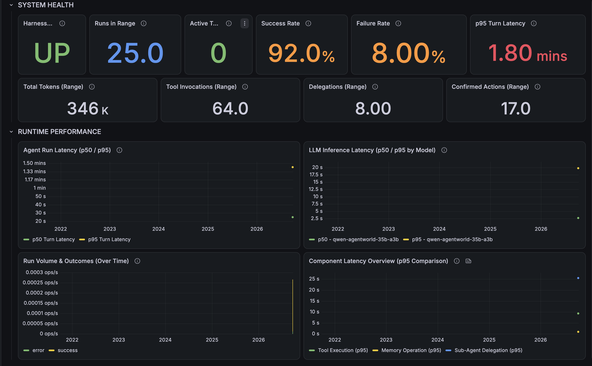
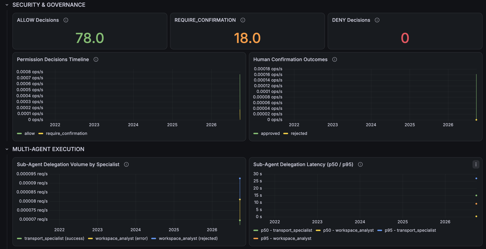
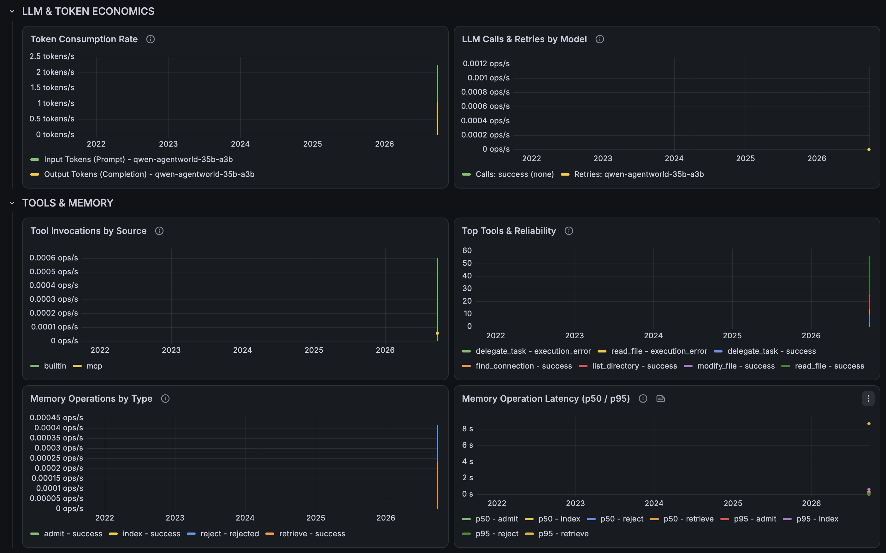
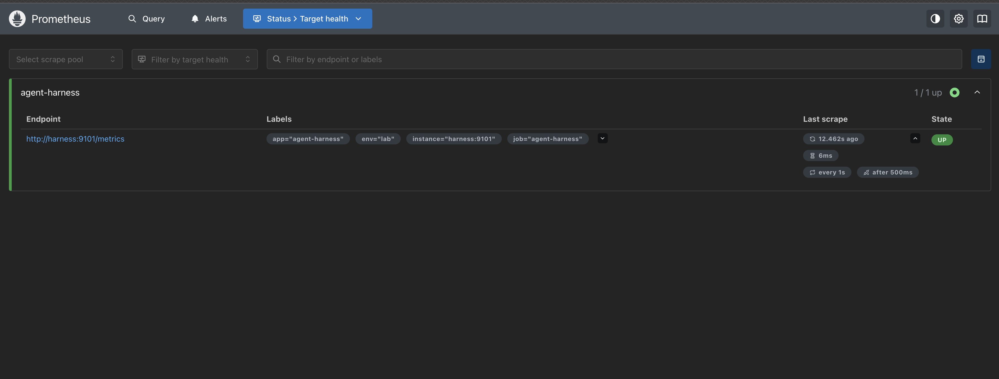

# Observability Evidence

The following screenshots show the monitoring and observability stack used by the Agent Harness.

## Grafana — System Health and Runtime Performance

## Grafana — Security, Governance and Multi-Agent Execution

## Grafana — LLM, Tool and Memory Metrics

## Prometheus Target Health

The Prometheus target view confirms that the Agent Harness metrics endpoint is actively scraped and reported as `UP`.

